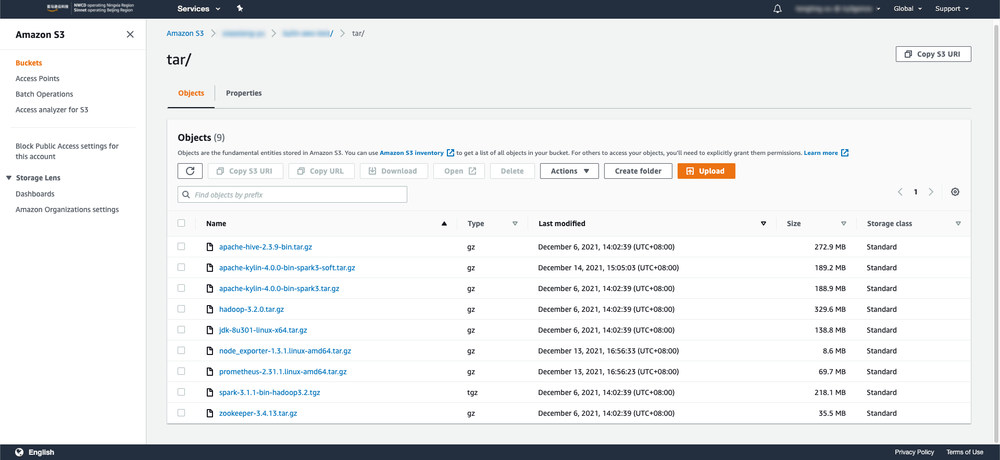

# How to deploy Kylin4 on EC2

Target: 

1. Deploy Kylin4 on Ec2 with Spark Standalone mode.

2. Removed the dependency of hadoop and start quickly.

3. Support to scale worker nodes for Spark standalone Cluster quickly and conveniently.

4. Enhance performance for query in using  `Local Cache + Soft Affinity` feature (Experimental Feature), please check the [details](https://mp.weixin.qq.com/s/jEPvWJwSClQcMLPm64s4fQ).

5. Support to monitor cluster status with prometheus server.

6. Create a Kylin4 cluster on aws in 10 minutes.

## Prerequisite

##### I. Clone or Download this repo

##### II. Download Packages & Upload them to S3 Path which suffix is */tar, example: `s3://xxx/kylin/tar`

> Note: Download packages for decreasing time of installation.

1. Download Kylin4 package by [official website](https://kylin.apache.org/download/)

2. Download Hadoop, [version 3.2.0](https://archive.apache.org/dist/hadoop/common/hadoop-3.2.0/hadoop-3.2.0.tar.gz)

3. Download Spark with hadoop3.2, [version 3.1.1](https://archive.apache.org/dist/spark/spark-3.1.1/spark-3.1.1-bin-hadoop3.2.tgz)

4. Download Hive, [version 2.3.9](https://archive.apache.org/dist/hive/hive-2.3.9/apache-hive-2.3.9-bin.tar.gz)

5. Download Zookeeper, [version 3.4.9](https://archive.apache.org/dist/zookeeper/zookeeper-3.4.9/zookeeper-3.4.9.tar.gz)

6. Download JDK, [version 1.8_301](https://www.oracle.com/java/technologies/javase/javase8u211-later-archive-downloads.html)

7. Download Node Exporter, [version 1.3.1](https://github.com/prometheus/node_exporter/releases/download/v1.3.1/node_exporter-1.3.1.linux-amd64.tar.gz)

8. Download Prometheus Server, [version 2.31.1](https://github.com/prometheus/prometheus/releases/download/v2.31.1/prometheus-2.31.1.linux-amd64.tar.gz)

9. Download Kylin4 package with local cache + soft affinity feature by [public website](https://s3.cn-northwest-1.amazonaws.com.cn/asia.public.kyligence.io/kylin/apache-kylin-4.0.0-bin-spark3-soft.tar.gz)

> Note: 
>   If you download not match jdk version, please check the scripts/*.sh which variables about jdk!
>
>   If you want to use Kylin4 with local cache + soft affinity feature, please download the `experimental` package above.

##### III. Check dependent jars of Kylin4 in `./backup/jars` & Upload them to S3 Path which suffix is */jars, example: `s3://xxx/kylin/jars`

Kylin4 needed extra jars

- Basic jars
    - commons-configuration-1.3.jar
    - mysql-connector-java-5.1.40.jar
- Local Cache + Soft Affinity needed jars
    - alluxio-2.6.1-client.jar
    - kylin-soft-affinity-cache-4.0.0-SNAPSHOT.jar

##### IV. Check needed deploy scripts in `./backup/scripts` & Upload them to S3 Path which suffix is */scripts, example: `s3://xxx/kylin/scripts`

- prepare-ec2-env-for-distribution.sh
- prepare-ec2-env-for-master.sh
- prepare-ec2-env-for-slave.sh

##### V. Initialize `./kylin_configs.yaml`

Configure parameters in `./kylin_configs.yaml`.

Required parameters:

- `IAMRole`: IAM role which has the access to S3 authority and will be created in `AWS Console -> IAM -> Roles`.

- `S3_FULL_BUCKET_PATH`: the prefix path of storing `jars/scripts/tar`, example `s3://xxx/kylin/tar` is for `tar` to store, then this path will be `s3://xxx/kylin`.

- `S3_BUCKET_PATH`: `S3_FULL_BUCKET_PATH` without prefix `s3:/`, example: `S3_FULL_BUCKET_PATH` is `s3://xxx/kylin`, so `S3_BUCKET_PATH` is `/xxx/kylin`.

- `KeyName`: security key name which will be created in `AWS Console-> EC2 -> Network & Security -> Key Pairs` is a set of security credentials that you use to prove your identity when connecting to an instance.

> Note: 
>   This step is important.  
>
>   If you want to change instance type/volume type/volume size for nodes, please change `Ec2Mode` from `test` to `product` in [`EC2_DISTRIBUTION_PARAMS`, `EC2_MASTER_PARAMS`, `EC2_SLAVE_PARAMS`, `EC2_SCALE_SLAVE_PARAMS`].
>
>   If you don't change `EC2Mode` from `test` to `product` then cluster will be created in default configuration!
>
>   If you don't change `USING_LOCALCACHE_SOFT_AFFINITY` from `"false"` to `"true"` then cluster will created normally without `Local Cache + Soft Affinity` feature!

Optional parameters:

- `Ec2InstanceTypeForDistribution`: Change `Ec2InstanceTypeForDistribution` type in `EC2_DISTRIBUTION_PARAMS` to what you want if you want change instance type of Distribution Node.

- `Ec2VolumnTypeForMasterNode`: Change `Ec2VolumnTypeForMasterNode` type in `EC2_DISTRIBUTION_PARAMS` to what you want if you want change volume type of Distribution Node.

- `Ec2VolumeSizeForMasterNode`: Change `Ec2VolumeSizeForMasterNode` type in `EC2_DISTRIBUTION_PARAMS` to what you want if you want change volume size of Distribution Node.

- `InstanceType` in `EC2_MASTER_PARAMS`: Change `InstanceType` type in `EC2_MASTER_PARAMS` to what you want if you want to change instance type of Master Node.

- `Ec2VolumnTypeForMasterNode`: Change `Ec2VolumnTypeForMasterNode` type in `EC2_MASTER_PARAMS` to what you want if you want to change volume type of Master Node.

- `Ec2VolumeSizeForMasterNode`: Change `Ec2VolumeSizeForMasterNode` type in `EC2_MASTER_PARAMS` to what you want if you want to change volume size of Master Node.

- `InstanceType` in `EC2_SLAVE_PARAMS`: Change `InstanceType` type in `EC2_SLAVE_PARAMS` to what you want if you want to change instance type of Slave Node.

- `Ec2VolumnTypeForSlaveNode`: Change `Ec2VolumnTypeForSlaveNode` type in `EC2_SLAVE_PARAMS` to what you want if you want to change volume type of Slave Node.

- `Ec2VolumeSizeForSlaveNode`: Change `Ec2VolumeSizeForSlaveNode` type in `EC2_SLAVE_PARAMS` to what you want if you want to change volume size of Slave Node.

- `InstanceType` in `EC2_SCALE_SLAVE_PARAMS`: Change `InstanceType` type in `EC2_SCALE_SLAVE_PARAMS` to what you want if you want to change instance type of `scaled` Slave Node.

- `Ec2VolumnTypeForSlaveNode` in `EC2_SCALE_SLAVE_PARAMS`: Change `Ec2VolumnTypeForSlaveNode` type in `EC2_SCALE_SLAVE_PARAMS` to what you want if you want to change volume type of `scaled` Slave Node.

- `Ec2VolumeSizeForSlaveNode` in `EC2_SCALE_SLAVE_PARAMS`: Change `Ec2VolumeSizeForSlaveNode` type in `EC2_SCALE_SLAVE_PARAMS` to what you want if you want to change volume size of `scaled` Slave Node.

##### VI. Initialize needed IAM role and Used User which have access to aws

> Note: 
>
> If IAM role has created, then set the role name to `cloudformation_templates/ec2-cluster-distribution.yaml`'s `Ec2OperationRole`
> 
> The working user who also must have the access to `S3`

##### VII. Initialize needed `SecurityGroupIngress` in `cloudformation_templates/ec2_or_emr_vpc.yaml`

## Deploy

1. Change path to `deploy-kylin-on-aws` directory

2. Make a virtual env for current repo

    > Note: 
    >  
    >  Use `source ./venv/bin/activate` to activate virtual env
    >
    >  Use `pip install -r ./requirements.txt` to install dependencies

3. Configure an aws account which has the access to aws console

    > Note: Use `aws configure` on terminal
    > 
    > Example:
    > 
    >     $ aws configure
    >
    >     AWS Access Key ID: 123456
    >
    >     AWS Secret Access Key: 123456
    >
    >     Default region name: cn-northwest-1
    >
    >     Default output format: json

4. Use `python ./deploy.py --type [deploy|destroy|list|scale_up|scale_down]` to control cluster.
   - deploy: create a cluster
   
   - destroy: destroy a already created cluster
   
   - list: list alive nodes which are with stack name and instance id
   
   - scale_up: scale up worker nodes for cluster
   
   - scale_down: scale down worker nodes for cluster

    > Note: Default Kylin4 Cluster is `all` mode, you can set `job` or `query` mode by setting param `Ec2KylinMode` in `kylin_configs.yaml`
