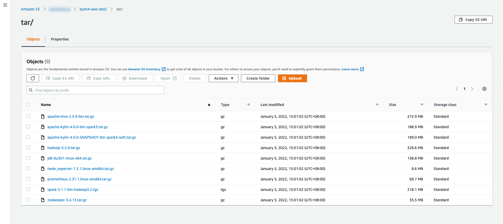
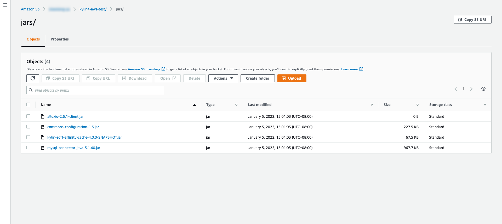
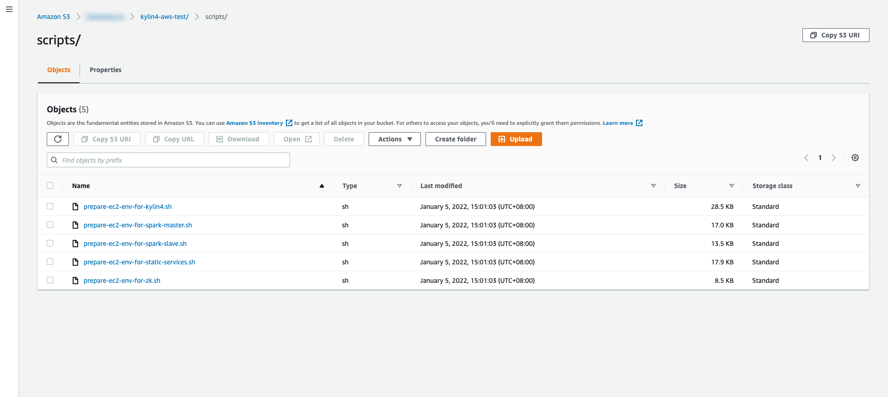

# How to deploy a Kylin4 Cluster on EC2

## Target

1. Deploy Kylin4 on Ec2 with Spark Standalone mode.
2. Removed the dependency of hadoop and start quickly.
3. Support to scale worker nodes for Spark standalone Cluster quickly and conveniently.
4. Improve performance for query in using  `Local Cache + Soft Affinity` feature (Experimental Feature), please check the [details](https://mp.weixin.qq.com/s/jEPvWJwSClQcMLPm64s4fQ).
5. Support to monitor cluster status with prometheus server.
6. Create a Kylin4 cluster on EC2 in 10 minutes.

## Structure

When cluster was created, services and nodes will like below:


- Services are created as the number order from 1 to 4.
- Every machine node is presented by a white box. 
- `Kylin Node` and `Spark Worker` Node can be scaled.
- Whole cluster will has only one RDS and only one the machine node which contains `Prometheus Server` and `Hive MetaStore` service.


## Prerequisites 

### Initiliaze AWS Account 

#### I. Create an `IAM` role

> Note: 
>
> ​	`IAM` role must have the access  which contains `AmazonEC2RoleforSSM` , `AmazonSSMFullAccess` and `AmazonSSMManagedInstanceCore`.
>
> ​	This `IAM` Role will be used to initialize every ec2 instances which are for creating an kylin4 cluster on aws. And it will configure in `Initilize Env of Local Mac` part.

#### II. Create a `User` 

> Note:
>
> ​	The `User` who is created in aws will be used to execute some operations on EC2 instance. So the `User` must has some authorities as below.

| Services            | Access level                                           | Resources     | Request condition |
| ------------------- | ------------------------------------------------------ | ------------- | ----------------- |
| **Cloudformation**  | **Limited**: List, Read,Write                          | All Resources | None              |
| **EC2**             | **Limited**: Read                                      | All Resources | None              |
| **IAM**             | **Limited**: List, Read, Write, Permissions management | All Resources | None              |
| **RDS**             | **Limited**: List, Write, Tagging                      | All Resources | None              |
| **S3**              | **Limited**: Write, Permissions management, Tagging    | All Resources | None              |
| **SNS**             | **Limited**: List                                      | All Resources | None              |
| **STS**             | **Limited**: Write                                     | All Resources | None              |
| **Systems Manager** | **Limited**: Write                                     | All Resources | None              |

#### III. Login the created `User` to create key pair and Access Key

> Note:
>
> ​	To deploy EC2 instances for Kylin4 Cluster need key pair and access key.

##### 1. Create a new `Key Pair` in the `EC2 -> Key pairs`


##### 2. Genrate a new `Access Key` which in the `My Security Credentials`

> Note: 
>
> ​	Please download the generated the csv file of `Access Key`  immediately. Get the `Access Key `  and `Secret Key` to initilize local mac to access aws.


### Initialize a S3 direcotry

#### I. Create a directory on S3

> Note: 
>
> ​	This directory will store tars, scripts and jars below. And it will also be the root path of working dir for kylin4.

Example: make a directory named `kylin4-aws-test` . You can also create a directory named what you like.


#### II. Download packages & Upload them to the S3 path which suffix is `*/tar`

> Create the directory named `tar` **in the path which was created by yourself**.  
>
> As example, the full path would be `s3://.../kylin4-aws-test/tar`.

1. Download Kylin4 package by [official website](https://kylin.apache.org/download/).
2. Download Hadoop, [version 3.2.0](https://archive.apache.org/dist/hadoop/common/hadoop-3.2.0/hadoop-3.2.0.tar.gz).
3. Download Spark with hadoop3.2, [version 3.1.1](https://archive.apache.org/dist/spark/spark-3.1.1/spark-3.1.1-bin-hadoop3.2.tgz).
4. Download Hive, [version 2.3.9](https://archive.apache.org/dist/hive/hive-2.3.9/apache-hive-2.3.9-bin.tar.gz).
5. Download Zookeeper, [version 3.4.9.](https://archive.apache.org/dist/zookeeper/zookeeper-3.4.9/zookeeper-3.4.9.tar.gz)
6. Download JDK, [version 1.8_301](https://www.oracle.com/java/technologies/javase/javase8u211-later-archive-downloads.html).
7. Download Node Exporter, [version 1.3.1.](https://github.com/prometheus/node_exporter/releases/download/v1.3.1/node_exporter-1.3.1.linux-amd64.tar.gz)
8. Download Prometheus Server, [version 2.31.1](https://github.com/prometheus/prometheus/releases/download/v2.31.1/prometheus-2.31.1.linux-amd64.tar.gz).
9. Download Kylin4 package with local cache + soft affinity feature by [public website.](https://s3.cn-north-1.amazonaws.com.cn/public.kyligence.io/kylin/apache-kylin-4.0.0-SNAPSHOT-bin-spark3-soft.tar.gz)


> Note: 
>   	If you want to use Kylin4 with local cache + soft affinity feature, please download the `experimental` package above.




#### III. Upload  `kylin-tpch/backup/jars/*` to the S3 Path which suffix is `*/jars`

> Create the directory named `jars` **in the path which was created by yourself**.  
>
> As example, the full path would be `s3://.../kylin4-aws-test/jars`.

Kylin4 needed extra jars

- Basic jars
    - commons-configuration-1.3.jar
    - mysql-connector-java-5.1.40.jar
- Local Cache + Soft Affinity feature needed jars
    - alluxio-2.6.1-client.jar
    - kylin-soft-affinity-cache-4.0.0-SNAPSHOT.jar



#### IV. Upload `kylin-tpch/backup/scripts/*` to the S3 Path which suffix is `*/scripts`

> Create the directory named `scripts` **in the path which was created by yourself**.  
>
> As example, the full path would be `s3://.../kylin4-aws-test/scripts`.

Scripts:

- prepare-ec2-env-for-kylin4.sh
- prepare-ec2-env-for-spark-master.sh
- prepare-ec2-env-for-spark-slave.sh
- prepare-ec2-env-for-static-services.sh
- prepare-ec2-env-for-zk.sh



### Initilize Env Of Local Mac

#### I.  Initilize a aws account on local mac to access AWS

> Use `Access Key` and `Secret Key ` above to Initilize a aws account on local mac. 

```shell
$ aws configure
AWS Access Key ID : *************
AWS Secret Access Key : *************
Default region name : cn-northwest-1
Default output format : json
```

> Note:
>
> 1. If this command got the response `-bash: aws: command not found`, please check in  [Getting started with the AWS CLI](https://docs.aws.amazon.com/cli/latest/userguide/cli-chap-getting-started.html).
> 2. Region name can be in [Available Regions](https://docs.aws.amazon.com/AWSEC2/latest/UserGuide/using-regions-availability-zones.html#concepts-available-regions).
> 3. Default output format is `json`.

#### II. Clone repo & checkout to branch of `deploy-kylin-on-aws`

commands:

`$ git clone https://github.com/Kyligence/kylin-tpch.git` 

`$ cd kylin-tpch`

`$ git checkout deploy-kylin-on-aws`

#### III. Make a Python virtual env

> Note: 
>
> ​	Make sure that your mac already has a Python which version is 3.6.6 or later.  

commands: 

(execute commands in the `/path/to/kylin-tpch`)

`$ python -m venv venv`

`$ source ./venv/bin/activate`

`$ pip install -r ./requirements.txt`

#### IV. Configure the `kylin-tpch/kylin_configs.yaml`

**Required parameters**:

- `AWS_REGION`: Current region for EC2 instances.

- `IAMRole`: IAM role which has the access to aws authority. This parameter will be set to created **name** of IAM role.
- `S3_FULL_BUCKET_PATH`: the prefix path of storing `jars/scripts/tar`. As example, this parameter will be set to `s3://.../kylin4-aws-test`.
- `KeyName`: Security key name is a set of security credentials that you use to prove your identity when connecting to an instance. This parameter will be set to created **name** of  `key pair` .
- `DB_IDENTIFIER`: this param should be only one in the `RDS -> Databases` . And it will be the name of created RDS database.
- `DB_PORT`: this param will be the port of created RDS database, default is `3306`.
- `DB_USER`: this param will be a login ID for the master user of your DB instance, default is `root`.
- `DB_PASSWORD`: this param will be the password of `DB_USER` to access DB instance. default is `123456test`, it's strongly suggest you to change it.

#### V. Configure the SecurityGroupIngress in the `kylin-tpch/cloudformation_templates/ec2-or-emr-vpc.yaml`

> **Important**:
>
> 1. This security config must be set, it's important to restrict the unsafe traffic to protect user on AWS.
> If you not set this param, tool will start failed.
> 1.  Details about `SecurityGroupIngress`, please check [AWS::EC2::SecurityGroupIngress](https://docs.aws.amazon.com/AWSCloudFormation/latest/UserGuide/aws-properties-ec2-security-group-ingress.html).


### Advanced Configs

> Note:
>
> ​	If you want quickly to start Kylin4 Cluster on aws, then skip this part and jump to the part of  `Run` directly. 

There are `9` modules params for tools.  Introductions as below:

- EC2_VPC_PARAMS: this params of module are for creating a vpc.
- EC2_RDS_PARAMS: this params of module are for creating a RDS.
- EC2_STATIC_SERVICES_PARAMS: this params of module are for creating a Prometheus Server and other static services.
- EC2_ZOOKEEPERS_PARAMS: this params of module are for creating a Zookeeper Cluster.
- EC2_SPARK_MASTER_PARAMS: this params of module are for creating a Spark Master node.
- EC2_KYLIN4_PARAMS: this params of module are for creating a Kylin4.
- EC2_SPARK_WORKER_PARAMS: this params of module are for creating **Spark Workers**, default is **3** spark workers.
- EC2_KYLIN4_SCALE_PARAMS: this params of module are for scaling **Kylin4 nodes**, **Kylin4 nodes range** is related to `KYLIN_SCALE_NODES`.
- EC2_SPARK_SCALE_SLAVE_PARAMS: this params of module are for scaling **Spark workers**, **Spark Workers range** is related to `SPARK_WORKER_SCALE_NODES`.


User also can customize the params in `kylin-tpch/kylin_configs.yaml` to create an expected instances. Such as the type of instance, the volume size of instance and volumn type of instance and so on.

> Note:	
>
> 1. If you don't change `EC2Mode` from `test` to `product` in the ``kylin-tpch/kylin_configs.yml` then services will be created in default configuration! 
>    - As an example in `EC2_STATIC_SERVICES_PARAMS`:
>      - change `Ec2Mode `  from `test`to `product`
>      - change `Ec2InstanceTypeForStaticServices`  from `m5.2xlarge` to `m5.4xlarge`.
>      - change `Ec2VolumeSizeForStaticServicesNode`  from `'20'` to `'50'.`
>      - change `Ec2VolumnTypeForStaticServicesNode` from `gp2` to `standard`.
>      - then create the node of static service node will be a ``m5.4xlarge` and it attach a volume which size is `50` and type is `standard`.
> 2. Now`Ec2Mode` **only effect** the related params are `Ec2InstanceTypeFor*`,`Ec2VolumeSizeFor*`  and `Ec2VolumnTypeFor`* in the params modules.
> 3. `Ec2Mode` is only in [`EC2_STATIC_SERVICES_PARAMS`, `EC2_ZOOKEEPERS_PARAMS`, `EC2_SPARK_MASTER_PARAMS`, `EC2_KYLIN4_PARAMS`, `EC2_SPARK_WORKER_PARAMS`, `EC2_KYLIN4_SCALE_PARAMS`, `EC2_SPARK_SCALE_SLAVE_PARAMS`].
> 4. If you don't change `USING_LOCALCACHE_SOFT_AFFINITY` from `"false"` to `"true"` then cluster will created normally without `Local Cache + Soft Affinity` feature!
> 5. If user want to overwrite the params in the `kylin-tpch/cloudformation_templates/*.yaml`, you can copy the param name to 


## Run

Use `python ./deploy.py --type [deploy|destroy|list|scale] --scale-type [up|down] --node-type [kylin|spark_worker]`  to control cluster.
- deploy: create a cluster

- destroy: destroy a created cluster

- list: list alive nodes which are with stack name and instance id

- scale: User must be used with `--scale-type` and `--node-type`

  > Note:
  >
  > 1. Current support to scale up/down kylin or spark-worker.
  > 2. Before scale up/down kylin or spark-worker nodes, Cluster must be ready .

Examples:

- Create a cluster

```sh
$ python ./deploy.py --type deploy
```

- Desctroy a created cluster

```sh
$ python ./deploy.py --type destroy
```

- List alive nodes which will contains the `Stack Name`,`Instance Id`,`Public Id` and `Private Ip`.

```sh
$ python ./deploy.py --type list
```

- Scale up or down kylin nodes

```sh
$ python ./deploy.py --type scale --scale-type up[|down] --node-type kylin
```

- Scale up or down spark-worker nodes

```sh
$ python ./deploy.py --type scale --scale-type up[|down] --node-type spark_worker
```
